# Ecommerce UI Design
Ecommerce design with Xamarin Forms

## Developed using 
Xamarin Forms V 4.5.0.617 (Updated to 5.0) 
Learn More: https://docs.microsoft.com/en-us/xamarin/xamarin-forms/

## Features
* ColletionView
* SwipeView
* TabbedPage
* Font Icon

## Generate C# code from icon font
Link: https://andreinitescu.github.io/IconFont2Code/

## Screenshots

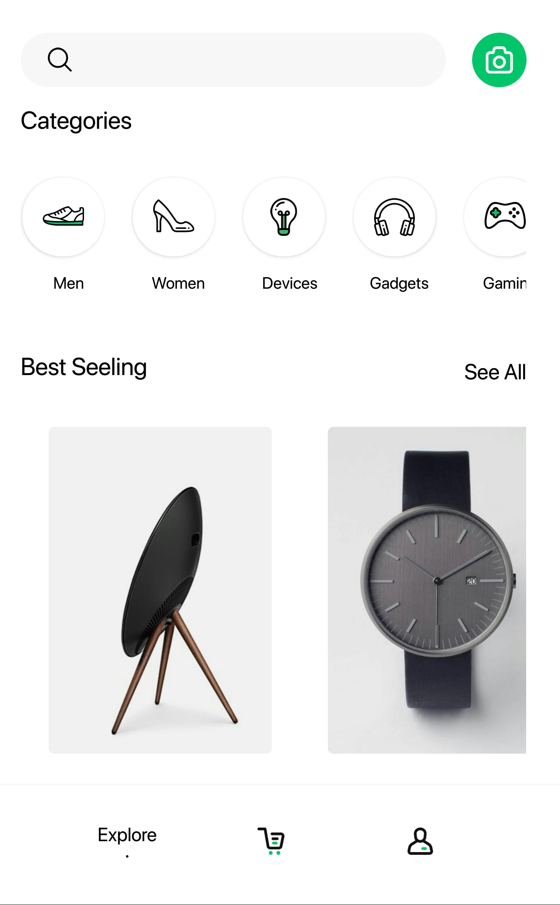 | 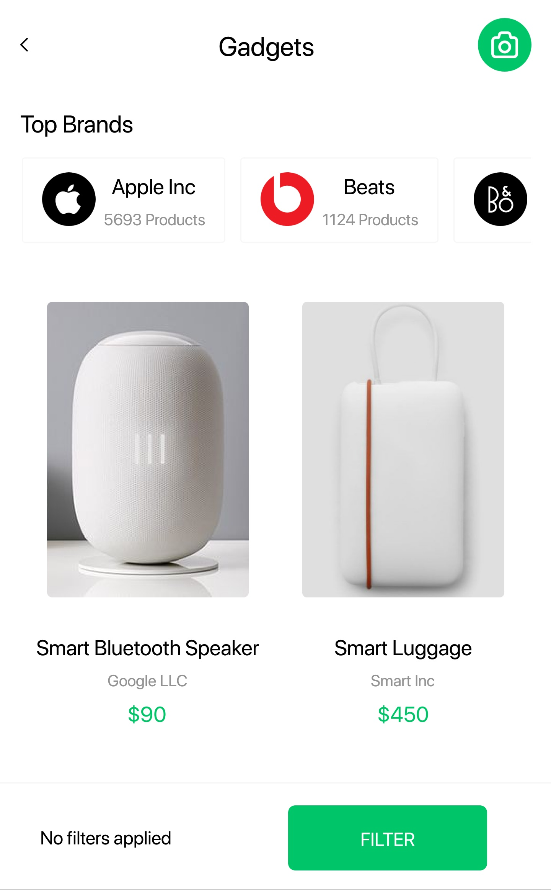 | 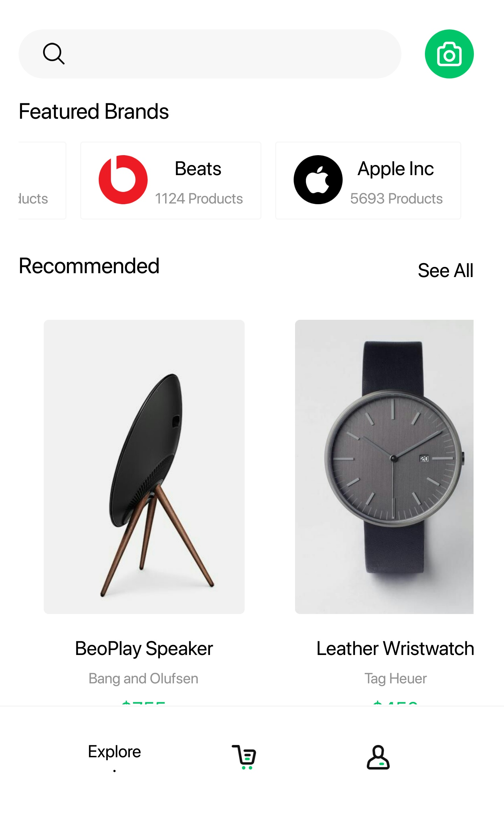 | 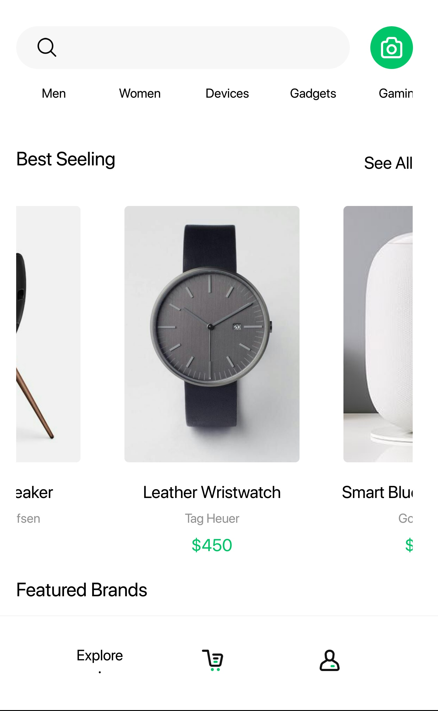 
-----------------------------------|------------------------------------|-----------------------------------|-----------------------------------
                         
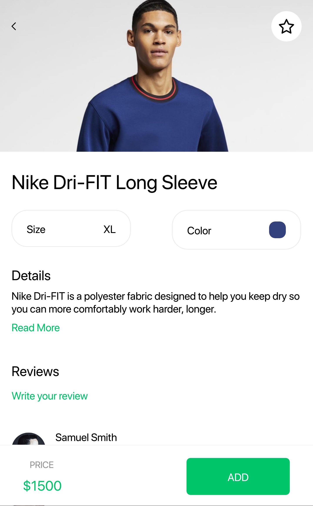 |  | 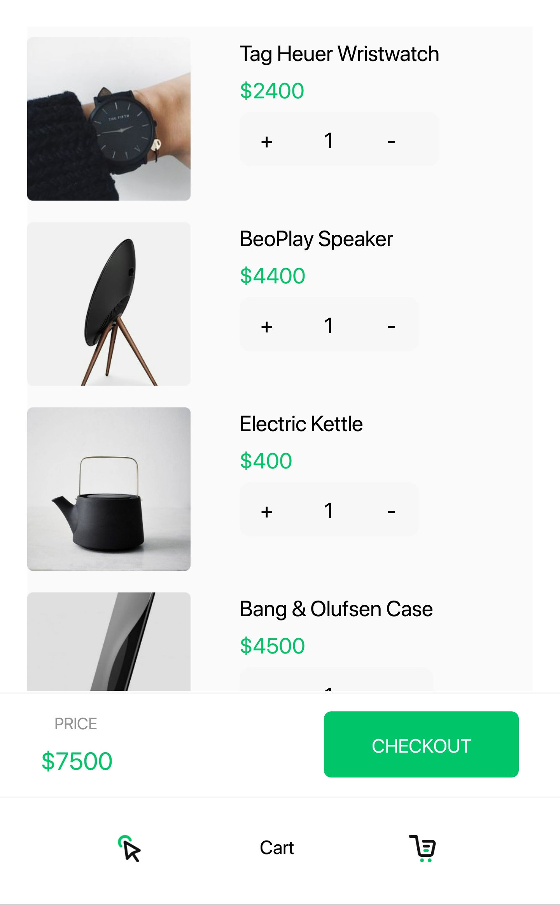 | 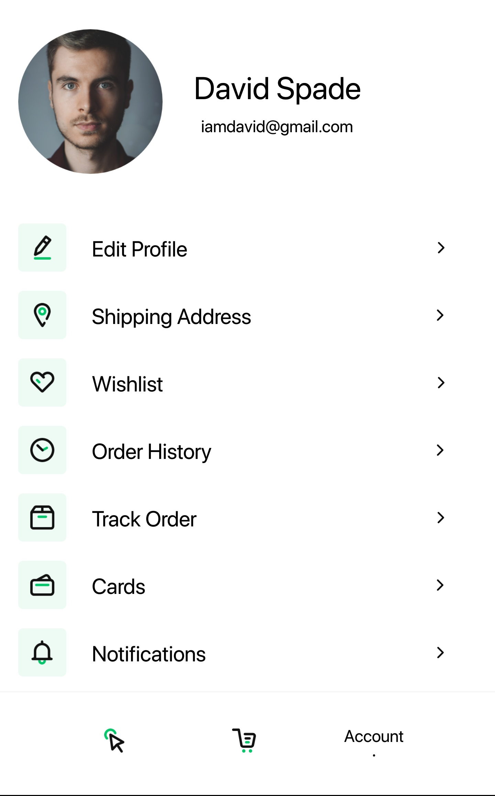 
-----------------------------------|------------------------------------|-----------------------------------|-----------------------------------

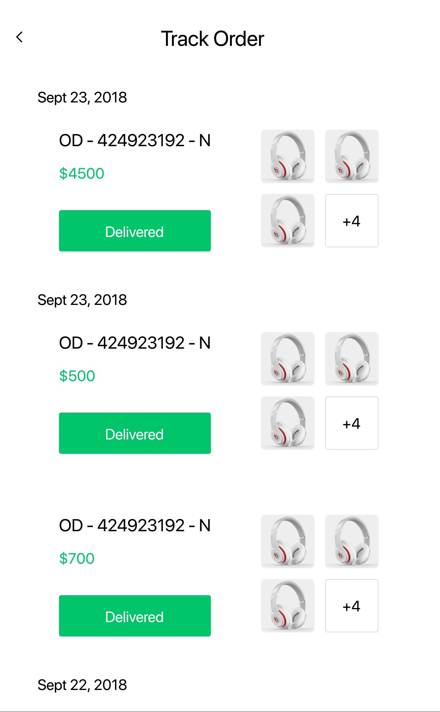 | 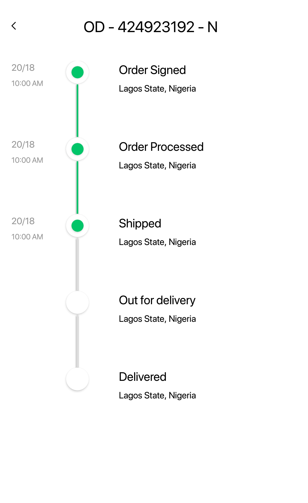 | 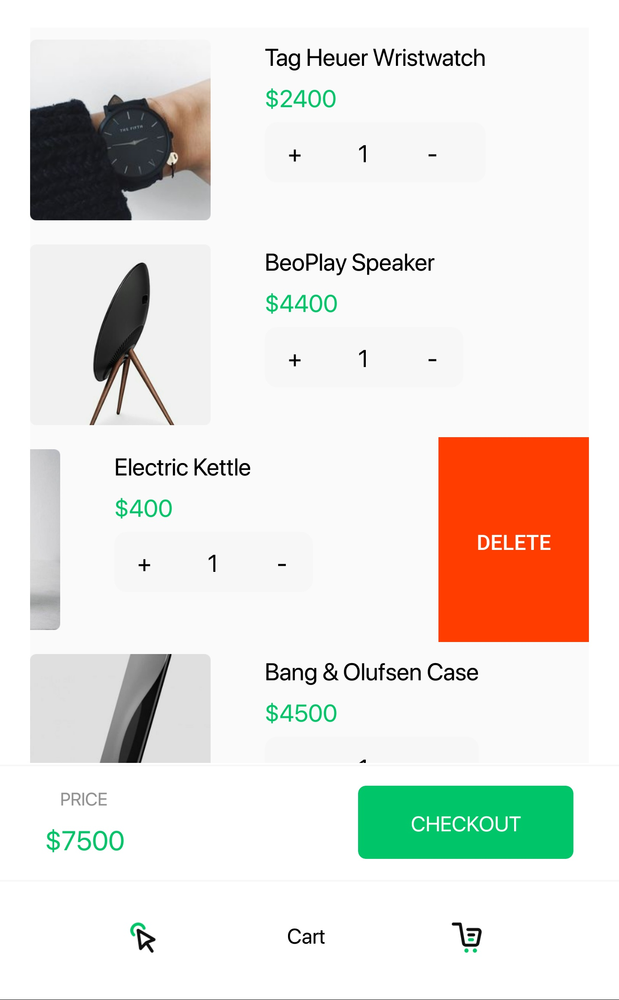 | 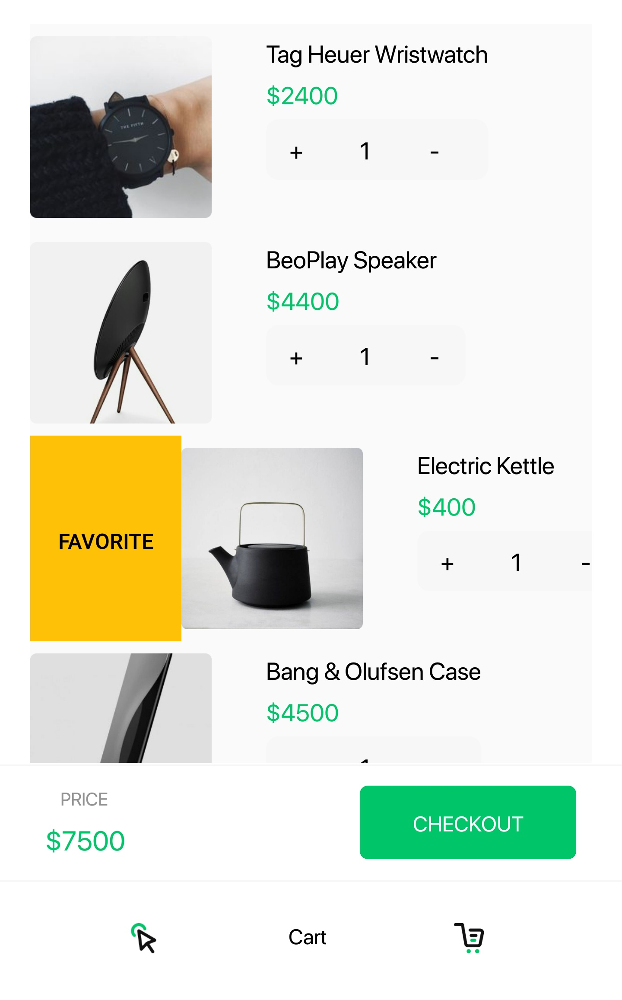 
-----------------------------------|------------------------------------|-----------------------------------|-----------------------------------

## Preview

